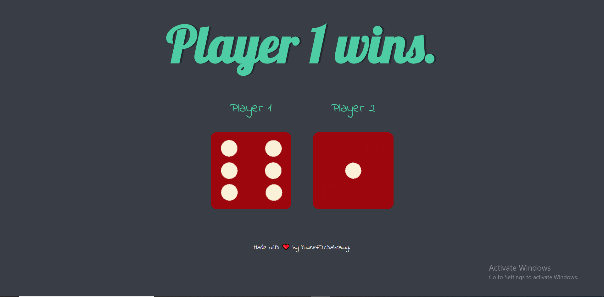

# Dice Challenge

Dice is a simple DOM manipulating challenge that I coded with Angela Yu in her Complete Full Stack course on Udemy.

## 💻 Build with

- HTML5
- CSS3
- Vanilla Javascript
- DOM API

## 📷 Screen Shot

